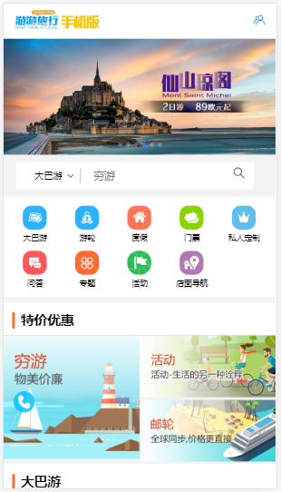
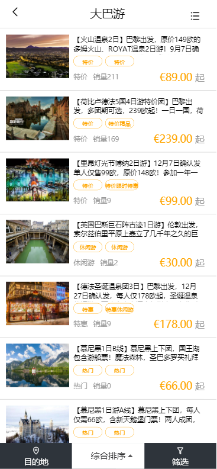
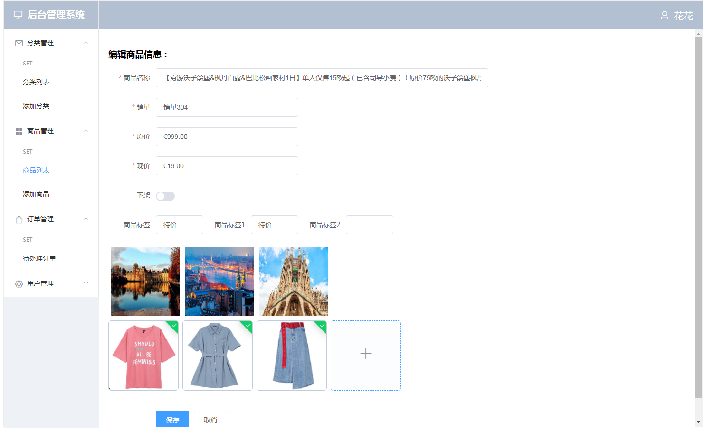

# 游游旅行

## 上线
   * 官网：[https://www.yoyoer.com/phone/](https://www.yoyoer.com/phone/)    
   * 上线地址：[https://http://47.98.56.8:3003](https://http://47.98.56.8:3003)
   * 后台管理系统：[https://http://47.98.56.8:3004](https://http://47.98.56.8:3004) 
   * githup地址：[git@github.com:gzh51906/youyouLuXing.git](git@github.com:gzh51906/youyouLuXing.git)  

## 项目类型
   * 旅游

## 团队与分工
   * 组长：陈观钦
   * 组员：潘颖俊、崔晓韩
   ---
   * 负责模块
       * 陈观钦：统筹项目、配置环境、模块安装、模块划分、构建node服务器、后端api编写、后台管理系统的实现
       * 潘颖俊：列表页、详情页、下单页面、对接api接口实现页面渲染、数据筛选
       * 崔晓韩：首页页面、注册登陆页面、帮助页面、我的页面、对接api接口实现页面渲染

## 项目页面截图
   * 首页
       * 
   * 列表页
       * 
   * 后台管理系统
       * 

## 项目目录说明
   * 游游旅行src文件夹树状图
   ```js

     └─src
        │  App.vue
        │  main.js
        │  
        │  
        ├─assets
        │  └─img
        │          kong.gif
        │          login-wb-icon.png
        │          logo.png
        │          
        ├─components
        │      AccountLogin.vue        
        │      AwaitComment.vue         
        │      AwaitConsumption.vue    
        │      AwaitPayment.vue
        │      bookingheader.vue
        │      busdongou.vue
        │      busfooter.vue
        │      busheader.vue
        │      busnanou.vue
        │      bussearch.vue
        │      busswiper.vue
        │      busxiou.vue
        │      Distributor.vue
        │      DynamicLogin.vue
        │      EmailReg.vue
        │      goodsfooter.vue
        │      goodsheader.vue
        │      Help.vue
        │      Helptitle.vue
        │      Home.vue
        │      Login.vue
        │      Mine.vue
        │      morefooter.vue
        │      moremain.vue
        │      Myaccount.vue
        │      MyCollection.vue
        │      Myjieban.vue
        │      Mynews.vue
        │      Myorder.vue
        │      Myordersearch.vue
        │      Mypintuan.vue
        │      Mytitle.vue
        │      Myyouji.vue
        │      Myzixun.vue
        │      Phone.vue
        │      PhoneReg.vue
        │      Refund.vue
        │      Reg.vue
        │      
        ├─mock
        │      listdata-mock.json
        │      
        ├─pages
        │      booking.vue
        │      bus.vue
        │      goods.vue
        │      more.vue
        │      save.vue
        │      
        ├─router
        │      index.js
        │      
        ├─static
        │      .gitkeep
        │      
        ├─store
        │      bus.js
        │      home.js
        │      index.js
        │      more.js
        │      user.js
        │      
        └─unit
                identify.vue
        
   ```
     * 游游旅行后台管理系统src文件夹树状图
   ```js
  │  App.vue
│  main.js
│  text.txt
│  
├─assets
│      logo.png
│      
├─components
│      HelloWorld.vue
│      
├─pages
│      addgoods.vue
│      addsort.vue
│      adduser.vue
│      goodslist.vue
│      login.vue
│      order.vue
│      setgoodslist.vue
│      setsortlist.vue
│      sortlist.vue
│      userlist.vue
│      
├─router
│      index.js
│      
└─store
        common.js
        index.js
   ```

   * 游游旅行后台管理系统src文件夹树状图
   ```js
  │  App.vue
│  main.js
│  text.txt
│  
├─assets
│      logo.png
│      
├─components
│      HelloWorld.vue
│      
├─pages
│      addgoods.vue
│      addsort.vue
│      adduser.vue
│      goodslist.vue
│      login.vue
│      order.vue
│      setgoodslist.vue
│      setsortlist.vue
│      sortlist.vue
│      userlist.vue
│      
├─router
│      index.js
│      
└─store
        common.js
        index.js
   ```
  
  
